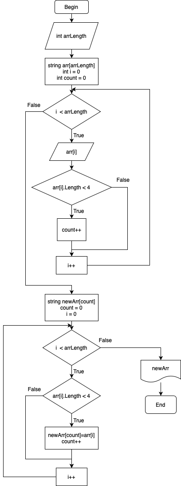

# Итоговая контрольная работа

## Задание
 Написать программу, которая из имеющегося массива строк формирует новый массив из строк, длина которых меньше, либо равна 3 символам. Первоначальный массив можно ввести с клавиатуры, либо задать на старте выполнения алгоритма. При решении не рекомендуется пользоваться коллекциями, лучше обойтись исключительно массивами.

## Блок-схема

## Текстовое решение
1. Нужно узнать длину массива, так как без длины придётся использовать другие структуры;
2. Создаём массив и заполняем его с клавиатуры;
3. Считаем, сколько элементов в массиве имеют длину менее 4 символов;
    > Это нужно, чтобы заранее узнать размер результирующего массива.
4. Создаём новый массив найденной ранее длины;
5. Перебираем введенный с клавиатуры массив и копируем элементы длиной менее 4 символов в новый массив, созданный на 4 шаге;
6. Выводим заполненный массив.